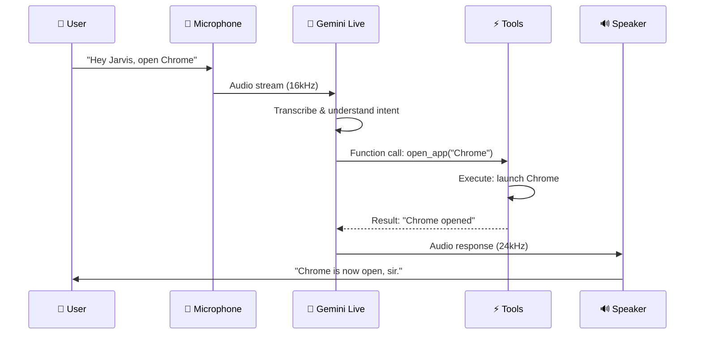

<div align="center">

# 🤖 Python AI Jarvis

### _"Good evening, sir. What shall we work on today?"_

[](https://python.org)
[](https://ai.google.dev/)
[](https://pypi.org/project/PyQt6/)
[](#)
[](#-license)

<br/>

```
     ╔══════════════════════════════════════════════════╗
     ║                                                  ║
     ║     ▄▀▀▀▄  ▄▀▀▀▄  ▄▀▀▀▄  ▄▀  ▀▄  ▄▀▀▀▄  ▄▀▀▀▄ ║
     ║     █   █  █▄▄▄█  █▄▄▄▀  █    █  █   █  █▄▄▄  ║
     ║     █   █  █   █  █   █  ▀▄  ▄▀  █   █      █ ║
     ║      ▀▀▀   ▀   ▀  ▀   ▀    ▀▀    ▀▀▀▀   ▀▀▀▀  ║
     ║              Just A Rather Very                  ║
     ║           Intelligent System (J.A.R.V.I.S)       ║
     ║                                                  ║
     ╚══════════════════════════════════════════════════╝
```

<br/>

> 🎙️ **A real-time voice AI assistant** powered by Google Gemini that can **hear**, **see**, **understand**, and **control** your entire computer — through natural conversation.

---

[Features](#-core-features) •
[Architecture](#-architecture) •
[Actions](#-action-modules) •
[Setup](#-quick-start) •
[Project Structure](#-project-structure) •
[Tech Stack](#-tech-stack) •
[Contributing](#-contributing)

</div>

---

## ✨ Core Features

<table>
<tr>
<td width="50%">

### 🎙️ Real-Time Voice Conversation
- **Ultra-low latency** audio streaming via Gemini Live API
- Bidirectional voice — hear and speak simultaneously
- 16kHz send / 24kHz receive audio pipeline
- Works in **any language** Gemini supports

### 👁️ Visual Awareness
- **Screen capture & analysis** on demand
- **Webcam vision** for camera-based queries
- Powered by Gemini's multimodal capabilities
- "What's on my screen?" → instant analysis

### 🧠 Persistent Memory
- Remembers your **identity, preferences, projects**
- Auto-stores context across sessions
- JSON-backed long-term memory with smart trimming
- Categories: identity, preferences, projects, relationships, notes

</td>
<td width="50%">

### 🖥️ Full Computer Control
- **Open any app** — Chrome, Spotify, VS Code, WhatsApp...
- **Volume, brightness, WiFi, dark mode** management
- **Keyboard/mouse automation** via PyAutoGUI
- Shutdown, restart, lock screen, screenshots

### 🌐 Browser Automation
- Control **Chrome, Edge, Firefox, Opera, Brave, Vivaldi**
- Navigate, click, type, fill forms, scroll
- **Smart element detection** — click by description
- Multi-browser support — run simultaneously

### 🤖 Autonomous Agent Mode
- **Multi-step task planning** with Gemini planner
- Auto-generates & executes Python code
- **Error handling** with intelligent retry & fix
- Task queue for sequential execution

</td>
</tr>
</table>

---

## 🏗️ Architecture

```
┌──────────────────────────────────────────────────────────────────────┐
│                         🤖 JARVIS SYSTEM                             │
├──────────────────────────────────────────────────────────────────────┤
│                                                                      │
│  ┌──────────────┐    ┌───────────────────┐    ┌──────────────────┐  │
│  │  🎨 UI Layer  │    │  🧠 Core Engine    │    │  ⚡ Action Layer │  │
│  │  (PyQt6)     │    │  (main.py)        │    │  (16 modules)   │  │
│  │              │    │                   │    │                  │  │
│  │ • Chat View  │◄──►│ • Gemini Live API │──►│ • open_app       │  │
│  │ • Voice Btn  │    │ • Audio Stream    │    │ • browser_ctrl   │  │
│  │ • File Drop  │    │ • Tool Dispatch   │    │ • computer_ctrl  │  │
│  │ • Sidebar    │    │ • Function Calls  │    │ • screen_process │  │
│  │ • Particles  │    │                   │    │ • web_search     │  │
│  │ • Animations │    │                   │    │ • file_controller│  │
│  └──────────────┘    └─────────┬─────────┘    │ • youtube_video  │  │
│                                │              │ • send_message   │  │
│                     ┌──────────┴──────────┐   │ • weather_report │  │
│                     │                     │   │ • reminder       │  │
│               ┌─────┴─────┐   ┌───────────┤   │ • desktop_ctrl   │  │
│               │ 🧠 Memory  │   │ 🎯 Agent  │   │ • dev_agent      │  │
│               │            │   │           │   │ • code_helper    │  │
│               │ • Load     │   │ • Planner │   │ • flight_finder  │  │
│               │ • Update   │   │ • Executor│   │ • game_updater   │  │
│               │ • Trim     │   │ • Errors  │   │ • computer_set   │  │
│               │ • Format   │   │ • Queue   │   │ • file_processor │  │
│               └────────────┘   └───────────┘   └──────────────────┘  │
│                                                                      │
│  ┌──────────────────────────────────────────────────────────────────┐│
│  │  📡 Communication: Google Gemini 2.5 Flash (Native Audio)       ││
│  │  🔊 Audio: sounddevice (16kHz↑ / 24kHz↓) | 🖼️ Vision: mss+PIL  ││
│  └──────────────────────────────────────────────────────────────────┘│
└──────────────────────────────────────────────────────────────────────┘
```

### How It Works

```
   User Speaks          Gemini Processes         Tool Executed         Response
  ┌──────────┐        ┌──────────────┐        ┌──────────────┐      ┌──────────┐
  │ 🎤 Voice │──16kHz─►│ 🧠 Gemini    │─function│ ⚡ Action    │─────►│ 🔊 Audio │
  │  Input   │        │   Live API   │──call──►│   Module    │result│  Output  │
  └──────────┘        └──────────────┘        └──────────────┘      └──────────┘
       │                     │                                            │
       │              ┌──────┴──────┐                                     │
       │              │ Tool Calls: │                                     │
       │              │ • open_app  │                                     │
       │              │ • web_search│                                     │
       └──────────────│ • browser   │─────────────────────────────────────┘
                      │ • screen    │
                      │ • memory    │
                      └─────────────┘
```

---

## ⚡ Action Modules

| Module | File | Description |
|:---|:---|:---|
| 🚀 **App Launcher** | `open_app.py` | Opens any application by name across Windows/macOS/Linux |
| 🌐 **Browser Control** | `browser_control.py` | Full browser automation — navigate, click, type, forms, multi-browser |
| ⌨️ **Computer Control** | `computer_control.py` | Low-level mouse/keyboard automation via PyAutoGUI |
| 🔧 **Computer Settings** | `computer_settings.py` | Volume, brightness, WiFi, dark mode, window management |
| 🖥️ **Desktop Control** | `desktop.py` | Wallpaper, organize files, clean desktop, task management |
| 🔍 **Web Search** | `web_search.py` | DuckDuckGo-powered search with comparison mode |
| 📺 **YouTube** | `youtube_video.py` | Play, summarize, get info, trending videos |
| 👁️ **Screen Processor** | `screen_processor.py` | Screen capture + webcam analysis via Gemini Vision |
| 📂 **File Controller** | `file_controller.py` | CRUD file operations, search, disk usage |
| 📄 **File Processor** | `file_processor.py` | PDF, code, image analysis & processing |
| 💬 **Send Message** | `send_message.py` | WhatsApp/Telegram messaging automation |
| ⏰ **Reminder** | `reminder.py` | Scheduled reminders via Task Scheduler |
| 🌤️ **Weather** | `weather_report.py` | Real-time weather reports by city |
| ✈️ **Flight Finder** | `flight_finder.py` | Search and compare flight deals |
| 🎮 **Game Updater** | `game_updater.py` | Steam/Epic Games auto-update & download manager |
| 💻 **Dev Agent** | `dev_agent.py` | AI-powered code generation & development assistance |
| 🛠️ **Code Helper** | `code_helper.py` | Code analysis, debugging, and refactoring |

---

## 🚀 Quick Start

### Prerequisites

| Requirement | Version | Why |
|:---|:---|:---|
| **Python** | 3.10+ | Core runtime |
| **Google Gemini API Key** | — | Powers AI brain ([Get one free](https://aistudio.google.com/apikey)) |
| **Playwright Browsers** | — | Browser automation (auto-installed) |

### Installation

**1. Clone the repository**
```bash
git clone https://github.com/hussnainahmedd/Pyhton-AI-Jarvis-.git
cd Pyhton-AI-Jarvis-/python
```

**2. Run the automated setup**
```bash
python setup.py
```
> This installs all pip dependencies + Playwright browsers automatically.

**3. Configure your API key**

Create `python/config/api_keys.json`:
```json
{
  "gemini_api_key": "YOUR_GEMINI_API_KEY_HERE"
}
```

**4. Launch Jarvis**
```bash
python main.py
```

> [!TIP]
> 🎥 **Video walkthrough available:** [Watch the full setup video on YouTube](https://youtu.be/ej1f5OE3SNQ?si=lCxDhJix9ungq1Ry)

---

## 📂 Project Structure

```
python/
│
├── main.py                    # 🧠 Core engine — Gemini Live API, audio streaming,
│                              #    tool declarations, function call dispatch
│
├── ui.py                      # 🎨 PyQt6 GUI — Iron Man inspired dark UI with
│                              #    particles, animations, chat view, voice controls
│
├── setup.py                   # ⚙️ Automated installer for dependencies
├── requirements.txt           # 📦 Python package dependencies
├── readme.md                  # 📖 Original project documentation
│
├── actions/                   # ⚡ Tool modules (one per capability)
│   ├── open_app.py            #    Launch applications
│   ├── browser_control.py     #    Full browser automation
│   ├── computer_control.py    #    Mouse/keyboard control
│   ├── computer_settings.py   #    OS settings management
│   ├── desktop.py             #    Desktop file/wallpaper control
│   ├── web_search.py          #    DuckDuckGo web search
│   ├── youtube_video.py       #    YouTube integration
│   ├── screen_processor.py    #    Screen/webcam vision
│   ├── file_controller.py     #    File system operations
│   ├── file_processor.py      #    Document/image processing
│   ├── send_message.py        #    Messaging automation
│   ├── reminder.py            #    Scheduled reminders
│   ├── weather_report.py      #    Weather data
│   ├── flight_finder.py       #    Flight search
│   ├── game_updater.py        #    Steam/Epic game updates
│   ├── dev_agent.py           #    AI code generation
│   └── code_helper.py         #    Code analysis tools
│
├── agent/                     # 🎯 Autonomous agent system
│   ├── planner.py             #    Breaks goals into tool-call steps
│   ├── executor.py            #    Executes plans & generated code
│   ├── error_handler.py       #    Intelligent error analysis & fixes
│   └── task_queue.py          #    Sequential task management
│
├── config/                    # ⚙️ Configuration
│   ├── __init__.py            #    Config loader & OS detection
│   └── api_keys.json          #    API credentials (gitignored)
│
├── core/                      # 🧬 Core prompts
│   └── prompt.txt             #    JARVIS personality & behavior rules
│
└── memory/                    # 🧠 Persistent memory system
    ├── __init__.py
    ├── memory_manager.py      #    Load/save/trim long-term memory
    ├── config_manager.py      #    Memory configuration
    └── long_term.json         #    Stored user context & preferences
```

---

## 🛠️ Tech Stack

<div align="center">

| Layer | Technology | Purpose |
|:---|:---|:---|
| 🧠 **AI Engine** | Google Gemini 2.5 Flash (Native Audio) | Real-time voice conversation + tool calling |
| 🎨 **Desktop UI** | PyQt6 | Iron Man inspired dark theme with particle effects |
| 🔊 **Audio** | sounddevice | 16kHz capture / 24kHz playback streaming |
| 🌐 **Browser** | Playwright | Cross-browser automation (Chrome/Edge/Firefox) |
| ⌨️ **Automation** | PyAutoGUI, pygetwindow | Mouse/keyboard/window control |
| 👁️ **Vision** | mss, OpenCV, Pillow | Screen capture & image processing |
| 🔍 **Search** | duckduckgo-search, BeautifulSoup4 | Web scraping & search |
| 📊 **System** | psutil, comtypes, pycaw | Process/audio/system management |
| 💾 **Storage** | JSON (pathlib) | Memory persistence & config |

</div>

---

## 🎨 UI Preview

The interface features an **Iron Man / Arc Reactor inspired** design with:

- 🌑 **Deep dark theme** (`#00060a` base) with cyan/orange accents
- ✨ **Floating particle animations** in the background
- 💬 **Chat-style conversation view** with message bubbles
- 🎤 **One-click voice activation** with visual feedback
- 📂 **Drag & drop file uploads** for document processing
- 📊 **System status sidebar** with real-time metrics
- 🎚️ **Fully resizable & responsive** layout

---

## 🔄 Voice Conversation Flow



---

## 🧠 Memory System

Jarvis persistently remembers context about you across sessions:

```json
{
  "identity": { "name": { "value": "Hussnain", "updated": "2026-06-17" } },
  "preferences": { "theme": { "value": "dark mode", "updated": "2026-06-17" } },
  "projects": { "jarvis": { "value": "AI assistant project", "updated": "2026-06-17" } },
  "relationships": {},
  "wishes": {},
  "notes": {}
}
```

- **Auto-trimming** when memory exceeds 2200 chars — oldest entries pruned first
- **Thread-safe** with `threading.Lock` for concurrent access
- **Injected into system prompt** for context-aware responses

---

## 🤝 Contributing

Contributions are welcome! Here's how:

1. **Fork** the repository
2. **Create** a feature branch (`git checkout -b feature/amazing-feature`)
3. **Commit** your changes (`git commit -m '✨ Add amazing feature'`)
4. **Push** to the branch (`git push origin feature/amazing-feature`)
5. **Open** a Pull Request

---

## 📜 License

This project is open source and available under the [MIT License](LICENSE).

---

## 🙏 Credits

- Built on [MARK XXXIX by FatihMakes](https://youtu.be/ej1f5OE3SNQ?si=lCxDhJix9ungq1Ry)
- Powered by [Google Gemini](https://ai.google.dev/) AI
- UI framework: [PyQt6](https://pypi.org/project/PyQt6/)

---

<div align="center">

**⭐ Star this repo if Jarvis impressed you!**

<br/>

_"I am JARVIS. I am here to assist you with anything and everything."_

<br/>

Built with 🐍 Python · 🧠 Gemini AI · 💙 PyQt6

</div>
